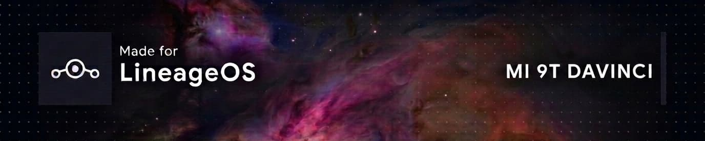

    <strong>
        <em>
        This project is not affiliated with LineageOS.
        </em>
    </strong>

 

# Nebula

Nebula is a weekly-built custom kernel for the Xiaomi Mi 9T (davinci), based on the LineageOS 4.14 kernel source. It ships with ReSukiSU (with SUSFS), Baseband Guard, NoMount, Droidspaces, and ReKernel integrated, compiled with the Neutron Clang toolchain using LTO and -O3.

# Requirements
- Xiaomi Mi 9T / Redmi K20 (davinci), running a LineageOS based rom (this kernel is built directly from LineageOS's own kernel tree, hasn't been tested against other ROMs)
- Custom recovery or ADB access for sideloading
- [ReSukiSU Manager](https://resukisu.github.io/guide/install.html#Get-manager) installed, to actually use root/SUSFS after flashing

# Release schedules
This kernel follows weekly builds of LineageOS. A new build is published every Sunday, announced on the [Telegram channel](https://t.me/Nebula_Kernel_Davinci) and the [GitHub releases page](https://github.com/Drsexo/davinci_kernel/releases).

# Features
- **ReSukiSU & SUSFS support**: KernelSU fork with SUSFS integration for non-GKI 4.14 devices
- **Baseband Guard**: LSM module that filters modem IPC traffic to mitigate baseband RCE attacks
- **NoMount**: Meta module that lets root apps hide specific mounts from non-root process detection
- **Droidspaces**: Adds container isolation patches and enables namespaces, netfilter, and bridge support for work profile apps like Shelter/Island
- **ReKernel**: Captures kernel panic and app crash tombstones, surfaces them to userspace for diagnostics
- **LTO + ThinLTO**: Link-time optimization for smaller and faster kernel binary
- **-O3**: Aggressive compiler optimization level
- **LLVM=1**: Full LLVM/Clang toolchain build (clang, lld, llvm-ar, llvm-nm)
- **Neutron Clang**: Built with the latest Neutron Toolchains clang (LLVM main, rebuilt weekly)
- **EROFS**: Read-only filesystem support for system partitions
- **KALLSYMS_ALL**: Exposes all kernel symbols (required by ReSukiSU symbol lookup)

# Installation
On Recovery:
- Download both the flashable zip and the original boot image for your device as a backup.
- Flash or Sideload the flashable zip with `adb sideload <package.zip>`
- Allow to continue if you see Error 21 signature invalid.
- Reboot to system and pray everything works.
- Profit.

On ReSukiSU Manager:
- On ReSukiSU Manager, click the "Working" card on the ReSukiSU Manager Home Screen.
- You'll see flash AnyKernel3, click it, and select the flashable zip.
- Click next and the flashable will be installed. If you see KPM option, just choose follow kernel.
- Reboot and pray everything works.
- Profit.

Restore to default kernel:
- You'll need to remove everything inside `/data/adb`. You can do this with `su -c rm -rf /data/adb/*`.
- Then immediately reboot to bootloader/fastbootd.
- Flash the stock boot image with `fastboot flash boot <theoriginalbootimage.img>`
- Reboot with `fastboot reboot` and pray everything works.
- Profit.

# Credits
Patches & buildscript:
- [riarumoda](https://github.com/riarumoda) for the original perf_neon buildscripts & kernel patches that this fork is based on.
- [TBYOOL](https://github.com/tbyool) for the buildscripts & kernel patches.
- [JackA1ltMan](https://github.com/JackA1ltman) for ReSukiSU hook scripts, ReKernel scripts & SUSFS patches.
- [TheSillyOk](https://github.com/TheSillyOk) for LTO & kpatch fixup for 4.14 devices.

Projects:
- [ReSukiSU](https://github.com/ReSukiSU) for ReSukiSU.
- [vc-teahouse](https://github.com/vc-teahouse) for Baseband Guard.
- [maxsteeel](https://github.com/maxsteeel) for NoMount.
- [ravindu644](https://github.com/ravindu644) for Droidspaces.
- [Sakion-Team](https://github.com/Sakion-Team/Re-Kernel) for ReKernel.
- [Neutron-Toolchains](https://github.com/Neutron-Toolchains) for the Clang toolchain.
- [LineageOS](https://github.com/LineageOS) for kernel sources.
