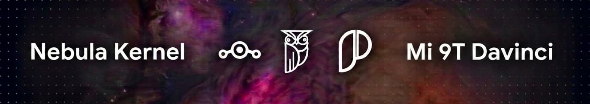

    <strong>
        <em>
        This project is not affiliated with any ROM.
        </em>
    </strong>

 

# Nebula

Nebula is a weekly-built custom kernel for the Xiaomi Mi 9T (davinci), built for LineageOS, PixelOS, and Derpfest on the 4.14 kernel source.  
It ships with ReSukiSU (with SUSFS), Baseband Guard, NoMount, Droidspaces, and ReKernel integrated, compiled with the Neutron Clang toolchain using LTO and -O3.

# Requirements
- Xiaomi Mi 9T / Redmi K20 (davinci), running latest LineageOS, PixelOS, or Derpfest
- Custom recovery or ADB access for sideloading
- [ReSukiSU Manager](https://resukisu.github.io/guide/install.html#Get-manager) installed, to actually use root/SUSFS after flashing

# Release schedules
New builds are published every Sunday, announced on the [Telegram channel](https://t.me/Nebula_Kernel_Davinci) and the [GitHub releases page](https://github.com/Drsexo/davinci_kernel/releases).

# Features
- **ReSukiSU & SUSFS support**: KernelSU fork with SUSFS integration for non-GKI 4.14 devices
- **Baseband Guard**: Linux Security Module (LSM) that blocks unauthorized writes to critical partitions and device nodes (baseband, boot chain) at the kernel level. Prevents user-space bypass of partition protection.
- **NoMount**: Meta module operating at the VFS layer. Avoids mount `--bind` so injections don't appear in `/proc/mounts` or `mountinfo`, making them invisible to detection methods.
- **Droidspaces**: Container runtime using Linux kernel namespaces to run full Linux distributions on Android with proper process isolation (PID, MNT, UTS, IPC, cgroup). 
- **ReKernel**: Exposes kernel events (panics, app crashes, tombstones) to userspace via a Netlink server. Lets tombstone tools capture and surface crash diagnostics
- **LTO + ThinLTO**: Link-time optimization for smaller and faster kernel binary
- **-O3**: Aggressive compiler optimization level
- **LLVM=1**: Full LLVM/Clang toolchain build (clang, lld, llvm-ar, llvm-nm)
- **Neutron Clang**: Built with the latest Neutron Toolchains clang (LLVM main, rebuilt weekly)

# Installation
Always back up your stock boot image first!  

On Recovery:
- Download the flashable zip.
- Sideload the flashable zip with `adb -d sideload /path/to/zip`
- Allow to continue if you see Error 21 signature invalid.
- Reboot.

If already rooted:
- Use [Kernel Flasher](https://github.com/fatalcoder524/KernelFlasher)  

Restore to default kernel:
- You'll need to remove everything inside `/data/adb`. You can do this with `su -c rm -rf /data/adb/*`.
- Then immediately reboot to fastboot.
- Flash the stock boot image with `fastboot flash boot path/to/img`

> [!IMPORTANT]
> PixelOS enforces signature verification on sideloaded zips. The kernel zip will fail to flash in the stock recovery. Use [OrangeFox recovery](https://sourceforge.net/projects/randomprojectfiles/files/ofox/latest) to flash this kernel.

# Credits
Patches & buildscript:
- [riarumoda](https://github.com/riarumoda) for the original perf_neon buildscripts & kernel patches that this fork is based on.
- [TBYOOL](https://github.com/tbyool) for the buildscripts & kernel patches.
- [JackA1ltMan](https://github.com/JackA1ltman) for ReSukiSU hook scripts, ReKernel scripts & SUSFS patches.
- [TheSillyOk](https://github.com/TheSillyOk) for LTO & kpatch fixup for 4.14 devices.

Projects:
- [ReSukiSU](https://github.com/ReSukiSU/ReSukiSU) for ReSukiSU.
- [vc-teahouse](https://github.com/vc-teahouse/Baseband-guard) for Baseband Guard.
- [maxsteeel](https://github.com/maxsteeel/nomount) for NoMount.
- [ravindu644](https://github.com/ravindu644/Droidspaces-OSS) for Droidspaces.
- [Sakion-Team](https://github.com/Sakion-Team/Re-Kernel) for ReKernel.
- [Neutron-Toolchains](https://github.com/Neutron-Toolchains/clang-build-catalogue) for the Clang toolchain.

Kernel source:
- [LineageOS](https://github.com/LineageOS/android_kernel_xiaomi_sm6150)  
- [PixelOS](https://github.com/PixelOS-Devices/android_kernel_xiaomi_sm6150)  
- [DerpFest](https://github.com/DerpFest-Devices/kernel_xiaomi_sm6150)
